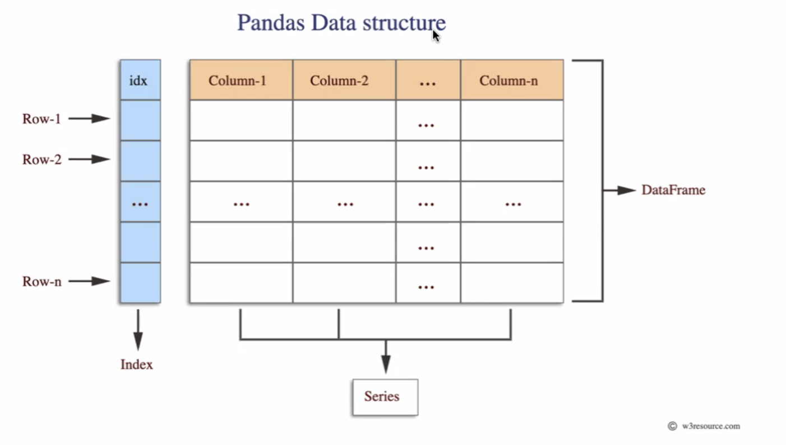

# Pandas

### STRUCTURA DE LOS DATOS

Los datos en pandas se pueden organizar como **tablas**, o estructuras _tabulares_ los cuales tienen un **indice**,  las _columnas_ van a tener un tipo de dato **serie**, todas las *columnas* con sus respectivos datos (o _series_) y sus respectivos **indices**, son denomidados **_dataframes_**. 

Podemos Observar lo anterior en la imagen de abajo:

