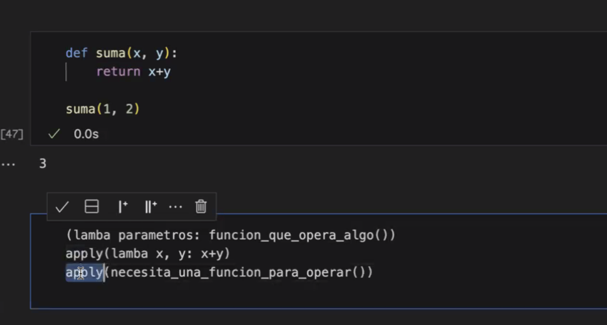
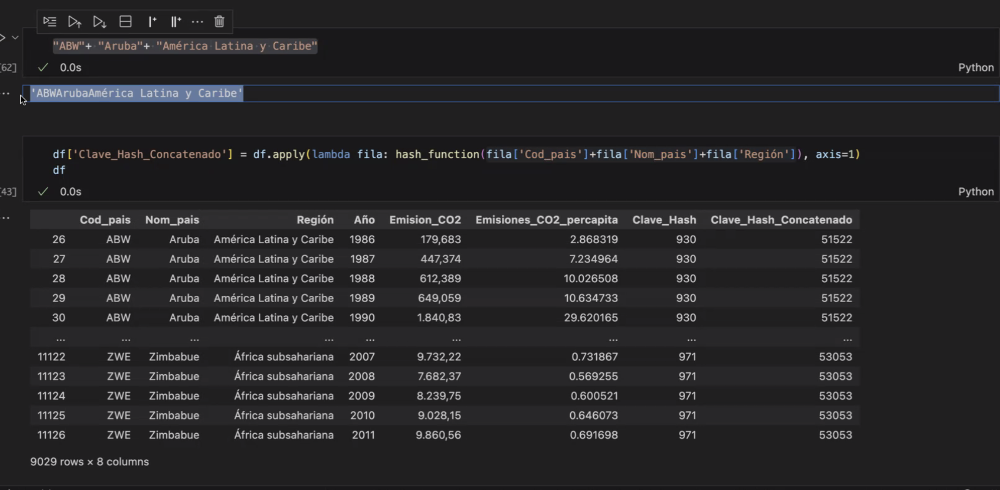

# Hash y Hasheo

## Importante para procesos de seguridad y authenticacion

```
def hash_function(key): return sum(index * ord(character) for index, character in enumerate(repr(key), start=1)) 
```

Cuando trabajamos con authenticacion  vamos a encontrar `ord` y `repr` donde el **primero** va a convertir su valor a valor _valor ASCII_ o valor en _unicode_, por otra parte el _segundo_ nos captura el **_valor_** o **_cadena_** de string de manera completa.

Esto indica que si el texto indicado tiene comillas tambien van a verse incluidas en el indice.



vamos a ver que podemos usar operaciones en los parametros para que se haga una operacion antes del volverlo parametro



Guardar los datos con idex = False, es informacion redundate


