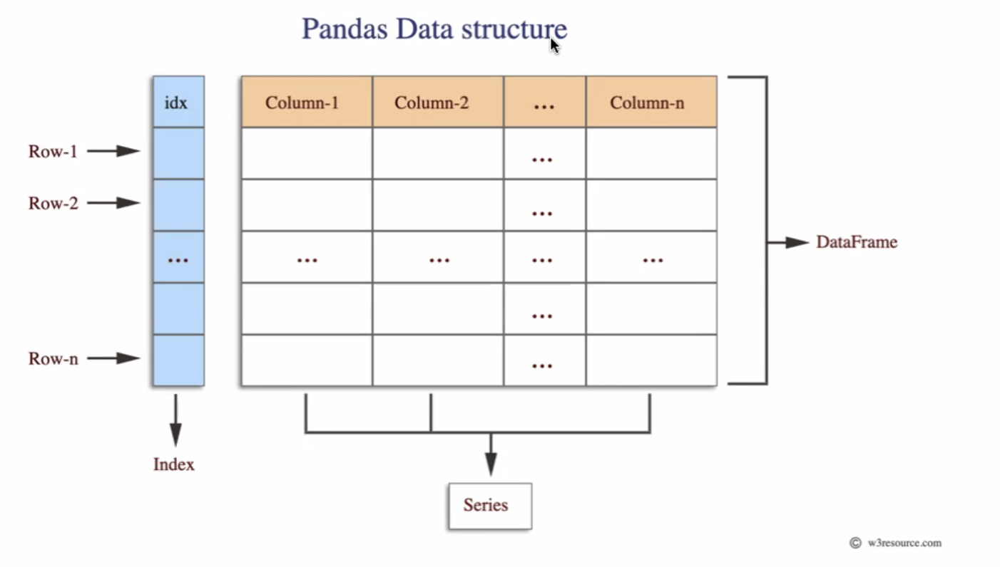
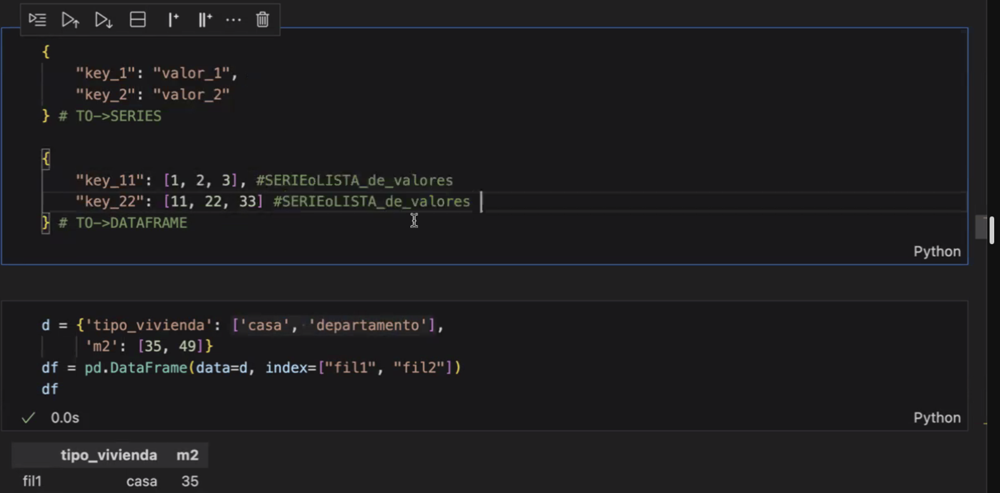

# Pandas

### STRUCTURA DE LOS DATOS

Los datos en pandas se pueden organizar como **tablas**, o estructuras _tabulares_ los cuales tienen un **indice**,  las _columnas_ van a tener un tipo de dato **serie**, todas las *columnas* con sus respectivos datos (o _series_) y sus respectivos **indices**, son denomidados **_dataframes_**. 

Podemos Observar lo anterior en la imagen de abajo:

Una **serie** tiene: ` "llave": "valor" `, pero no tienen **_indices_**, lo que si tienen un **dataframe** (_df_). Lo mejor es que podemos convertir las series en **dataframes**.

Podemos ver dicha conversion y lo mencionado anteriormente en la imagen de abajo:

> Mas informacion en la conversion y los parametros de conversion en la documentacion official: https://pandas.pydata.org/docs/reference/api/pandas.DataFrame.html