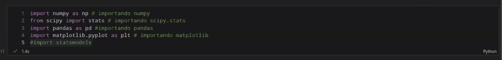

# Estadistica

## Medidas de tendencia central

- Media
- Mediana
- Moda
- Varianza
- Desviacion Estandar

## Desviacion estandar

Los datos con __desviaciones__ muy altas, aquellos que esten de 2 a 3 desviaciones alejados son datos **_atipicos_** una __desviacio__ alta es mayor a 2.5.