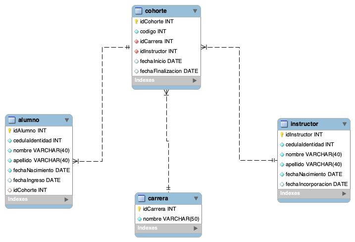

# Bases de datos

Una base de datos es un sistema organizado de almacenamiento de datos que permite almacenar, organizar, recuperar y manipular información de manera eficiente.

## Una base de datos en la nube

La nube, por otro lado, se refiere a la entrega de servicios de computación a través de Internet. Esto incluye recursos de almacenamiento, servidores, bases de datos, redes, software y más. En el contexto de las bases de datos, la nube ofrece una forma de alojar y gestionar bases de datos de manera remota, en lugar de hacerlo localmente en hardware físico.

### SQL y mySQL

El SQL (Structured Query Language) es un lenguaje estándar utilizado para administrar y consultar bases de datos relacionales. Permite crear, modificar y eliminar bases de datos y tablas, así como recuperar y manipular datos de manera eficiente. MySQL es un sistema de gestión de bases de datos (DBMS) de código abierto basado en SQL.

### Modelos y Tablas

**Modelos**

Un modelo de datos es una representación abstracta y estructurada de la información que se almacena en una base de datos. Define la manera en que los datos están organizados, almacenados y relacionados entre sí. Hay varios tipos de modelos de datos, como el modelo relacional, el modelo de red, el modelo jerárquico y el modelo de objetos, entre otros. Cada modelo tiene sus propias reglas y estructuras para representar los datos, y se elige según las necesidades específicas del sistema y las características de los datos que se manejan.

**Tablas**

Los modelos de datos están estrechamente relacionados con las tablas en una base de datos relacional. En el modelo relacional, que es el más comúnmente utilizado en sistemas de bases de datos, cada tabla representa una entidad o concepto del mundo real y las columnas de la tabla representan atributos de esa entidad. 

Las filas de la tabla contienen los datos reales. Por lo tanto, en un modelo relacional, las tablas son la forma en que se implementa y se estructura la información según el modelo de datos. En resumen, las tablas son la representación física de los modelos de datos en una base de datos relacional.

Un ejemplo de esto es el modelo de datos de Henry.


Para dicho modelo podemos ver un ejemplo del codigo:

```
-- Clear cualquier record anterior
DROP DATABASE IF EXISTS henry;

-- INNODB
CREATE DATABASE Henry;

-- Accede a la DB
USE Henry;

-- Creo las tablas
-- Primer componente de la BD

CREATE TABLE carrera (
	idCarrera INT NOT NULL AUTO_INCREMENT PRIMARY KEY,
    nombre VARCHAR (50) NOT NULL
    );

CREATE TABLE instructor (
	idInstructor INT NOT NULL AUTO_INCREMENT PRIMARY KEY,
	cedulaIdentidad INT NOT NULL UNIQUE,
	nombre VARCHAR(40) NOT NULL,
	apellido VARCHAR(40) NOT NULL,
	fechaNacimiento DATE NOT NULL,
	fechaIncorporacion DATE
);
```