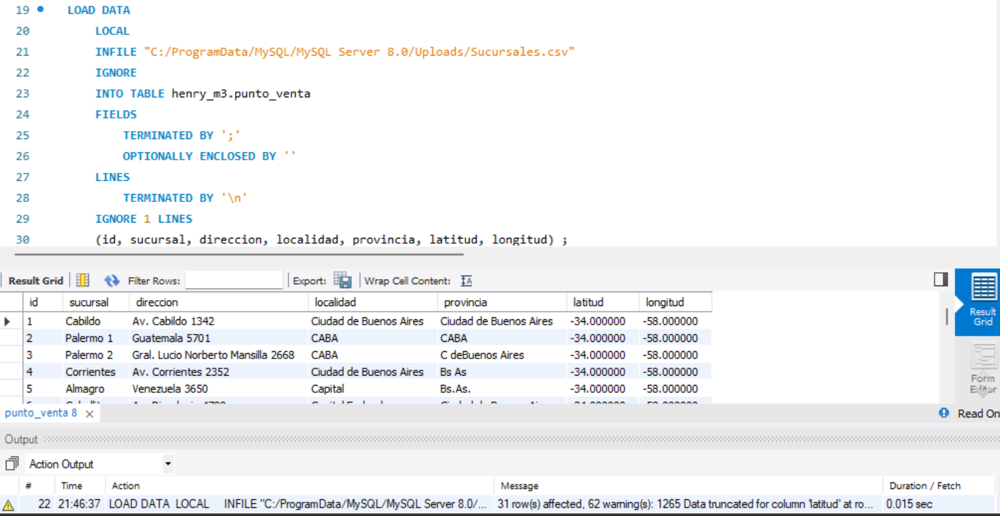

# Subiendo datos a MySQL desde CVS

Al iniciar la base de datos
```OPT_LOCAL_INFILE=1```

Dentro del script
```
SHOW GLOBAL VARIABLES LIKE 'local_infile'

SET GLOBAL local_infile = 1;
```

Dentro de las configuraciones de MySQL escoger un archivo my.init que es la configuracion de MySQL y las variables locales, en MAC en archivo cambia de nombre.

``` 
SELECT @@global.secure_file_priv;
```

Tambien se pueden subir datos usando Python.

*** MySQL no sabe leer los datos null *** y la subida de datos se puede ver interrumpida.

Es importante tener el comand

``` ENGINE = InnoDB DEFAULT CHARSET = utf8mb4 COLLATE = utf8mb4_spanish_ci; ```

Revisar las lienas del SQL provistos por Henry, _precio y cantidad_ estan comentados revisar el _tipo de variable_ .

Otra forma de evitar errores es
```
SET Precio = NULLIF(@Precio, '')
SET Cantidad = NULLIF(@Cantidad, '')
```
El codigo completo seria 

```
LOAD DATA INFILE 'C:\\ProgramData\\MySQL\\MySQL Server 8.0\\Uploads\\Venta.csv' 
INTO TABLE `venta` 
FIELDS TERMINATED BY ',' ENCLOSED BY '' ESCAPED BY '' 
LINES TERMINATED BY '\r\n' IGNORE 1
LINES (IdVenta, Fecha, Fecha_Entrega, IdCanal, IdCliente, IdSucursal, IdEmpleado, IdProducto, @Precio, @Cantidad) 
SET Precio = NULLIF(@Precio,''), 
    Cantidad = NULLIF(@Cantidad,'');
```
Al elegir el tipo de dato, considera el rango de valores que necesitas y el almacenamiento que quieres optimizar. Aquí hay una guía rápida para seleccionar el tipo adecuado:

Usa TINYINT si el rango de valores es muy pequeño (-128 a 127 o 0 a 255). *** Para las edades ***
Usa SMALLINT si el rango de valores es moderado (-32,768 a 32,767 o 0 a 65,535).
Usa MEDIUMINT si el rango de valores es más amplio (-8,388,608 a 8,388,607 o 0 a 16,777,215).




